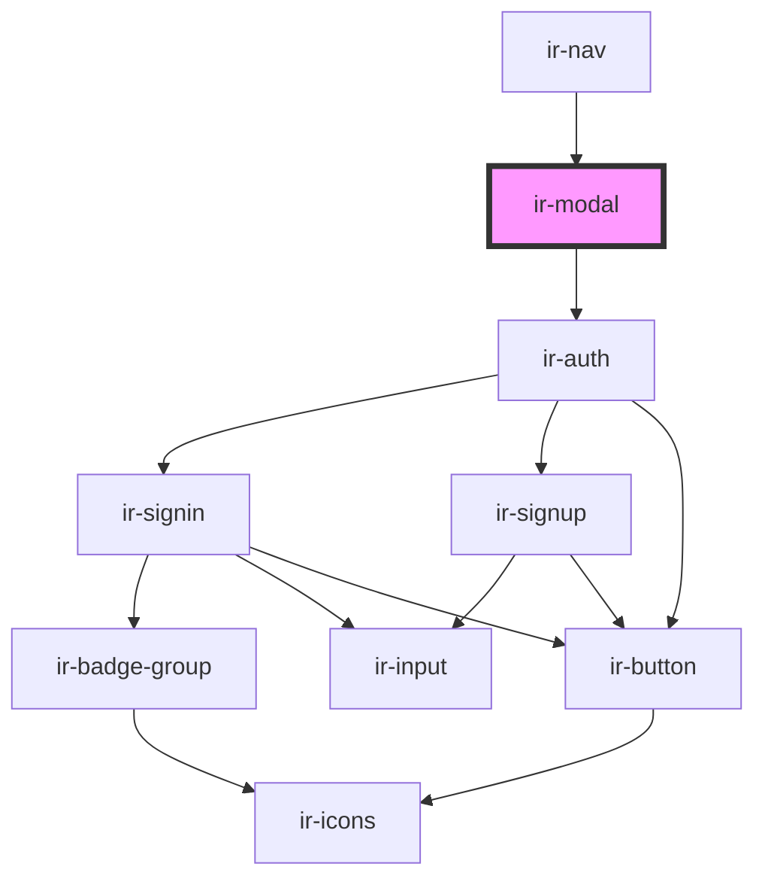

# ir-modal

<!-- Auto Generated Below -->

## Properties

| Property  | Attribute | Description | Type          | Default     |
| --------- | --------- | ----------- | ------------- | ----------- |
| `element` | --        |             | `HTMLElement` | `undefined` |

## Events

| Event        | Description | Type                   |
| ------------ | ----------- | ---------------------- |
| `openChange` |             | `CustomEvent<boolean>` |

## Methods

### `closeModal() => Promise<void>`

#### Returns

Type: `Promise<void>`

### `openModal() => Promise<void>`

#### Returns

Type: `Promise<void>`

## Dependencies

### Used by

 - [ir-nav](../../ir-booking-engine/ir-nav)

### Depends on

- [ir-auth](../../ir-booking-engine/ir-nav/ir-auth)

### Graph

----------------------------------------------

*Built with [StencilJS](https://stenciljs.com/)*
