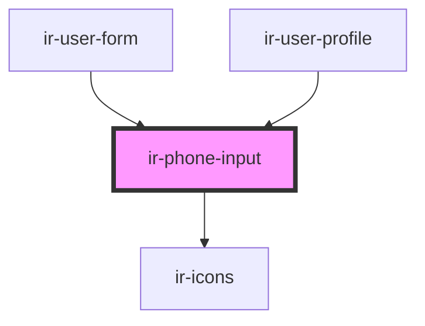

# ir-phone-input

<!-- Auto Generated Below -->

## Properties

| Property               | Attribute              | Description | Type                                         | Default                     |
| ---------------------- | ---------------------- | ----------- | -------------------------------------------- | --------------------------- |
| `country_code`         | `country_code`         |             | `number`                                     | `undefined`                 |
| `country_phone_prefix` | `country_phone_prefix` |             | `string`                                     | `undefined`                 |
| `error`                | `error`                |             | `boolean`                                    | `undefined`                 |
| `mobile_number`        | `mobile_number`        |             | `string`                                     | `undefined`                 |
| `mode`                 | `mode`                 |             | `"country_code_and_prefix" \| "prefix_only"` | `'country_code_and_prefix'` |

## Events

| Event             | Description | Type                                                     |
| ----------------- | ----------- | -------------------------------------------------------- |
| `phoneInputBlur`  |             | `CustomEvent<FocusEvent>`                                |
| `phoneInputFocus` |             | `CustomEvent<FocusEvent>`                                |
| `textChange`      |             | `CustomEvent<{ phone_prefix: string; mobile: string; }>` |

## Dependencies

### Used by

 - [ir-user-form](../../ir-booking-engine/ir-checkout-page/ir-user-form)
 - [ir-user-profile](../../ir-booking-engine/ir-nav/ir-user-profile)

### Depends on

- [ir-icons](../ir-icons)

### Graph

----------------------------------------------

*Built with [StencilJS](https://stenciljs.com/)*
