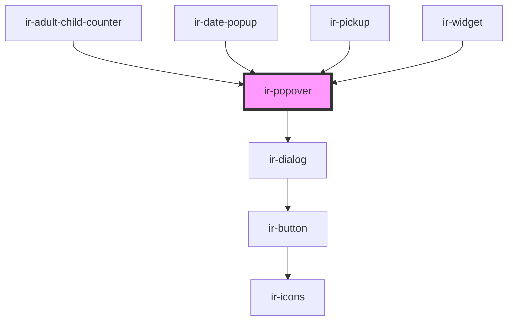

# ir-popover

<!-- Auto Generated Below -->

## Properties

| Property                        | Attribute                           | Description | Type                                                                                                                                                                                                         | Default     |
| ------------------------------- | ----------------------------------- | ----------- | ------------------------------------------------------------------------------------------------------------------------------------------------------------------------------------------------------------ | ----------- |
| `active`                        | `active`                            |             | `boolean`                                                                                                                                                                                                    | `false`     |
| `allowFlip`                     | `allow-flip`                        |             | `boolean`                                                                                                                                                                                                    | `true`      |
| `placement`                     | `placement`                         |             | `"auto" \| "auto-end" \| "auto-start" \| "bottom" \| "bottom-end" \| "bottom-start" \| "left" \| "left-end" \| "left-start" \| "right" \| "right-end" \| "right-start" \| "top" \| "top-end" \| "top-start"` | `undefined` |
| `showCloseButton`               | `show-close-button`                 |             | `boolean`                                                                                                                                                                                                    | `true`      |
| `stopListeningForOutsideClicks` | `stop-listening-for-outside-clicks` |             | `boolean`                                                                                                                                                                                                    | `false`     |
| `trigger_label`                 | `trigger_label`                     |             | `string`                                                                                                                                                                                                     | `''`        |

## Events

| Event        | Description | Type                   |
| ------------ | ----------- | ---------------------- |
| `openChange` |             | `CustomEvent<boolean>` |

## Methods

### `toggleVisibility() => Promise<void>`

#### Returns

Type: `Promise<void>`

## Dependencies

### Used by

 - [ir-adult-child-counter](../../ir-booking-engine/ir-booking-page/ir-adult-child-counter)
 - [ir-date-popup](../../ir-booking-engine/ir-booking-page/ir-availibility-header/ir-date-popup)
 - [ir-pickup](../../ir-booking-engine/ir-checkout-page/ir-pickup)
 - [ir-widget](../../ir-booking-widget)

### Depends on

- [ir-dialog](../ir-dialog)

### Graph

----------------------------------------------

*Built with [StencilJS](https://stenciljs.com/)*
