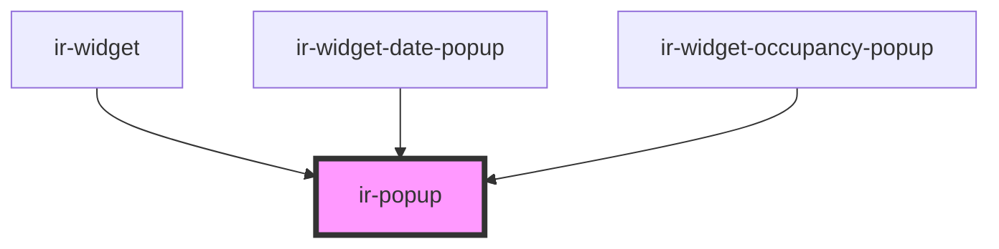

# ir-popup

<!-- Auto Generated Below -->

## Properties

| Property             | Attribute             | Description                                                                                 | Type                                                                                                                                                                 | Default                                     |
| -------------------- | --------------------- | ------------------------------------------------------------------------------------------- | -------------------------------------------------------------------------------------------------------------------------------------------------------------------- | ------------------------------------------- |
| `allowFlip`          | `allow-flip`          | Enable or disable flip behavior.                                                            | `boolean`                                                                                                                                                            | `true`                                      |
| `distance`           | `distance`            | Distance between the anchor and popup in pixels (used when offsetDistance is not provided). | `number`                                                                                                                                                             | `undefined`                                 |
| `fallbackPlacements` | `fallback-placements` | Comma-separated list of fallback placements used when flipping.                             | `string`                                                                                                                                                             | `'top-start,bottom-end,top-end,right,left'` |
| `modal`              | `modal`               | Whether this dialog is modal.                                                               | `boolean`                                                                                                                                                            | `false`                                     |
| `offsetDistance`     | `offset-distance`     | Offset distance in pixels away from the reference element.                                  | `number`                                                                                                                                                             | `undefined`                                 |
| `offsetSkid`         | `offset-skid`         | Offset skid in pixels along the reference element.                                          | `number`                                                                                                                                                             | `0`                                         |
| `overflowPadding`    | `overflow-padding`    | Padding for the preventOverflow modifier.                                                   | `number`                                                                                                                                                             | `8`                                         |
| `placement`          | `placement`           | Popper placement, e.g. "bottom-start".                                                      | `"bottom" \| "bottom-end" \| "bottom-start" \| "left" \| "left-end" \| "left-start" \| "right" \| "right-end" \| "right-start" \| "top" \| "top-end" \| "top-start"` | `'bottom-start'`                            |
| `strategy`           | `strategy`            | Positioning strategy ("absolute" or "fixed").                                               | `"absolute" \| "fixed"`                                                                                                                                              | `'absolute'`                                |
| `sync`               | `sync`                | Syncs the popup's width or height to that of the anchor element.                            | `"both" \| "height" \| "width"`                                                                                                                                      | `undefined`                                 |
| `withArrow`          | `with-arrow`          | Enable or disable the arrow element.                                                        | `boolean`                                                                                                                                                            | `true`                                      |

## Events

| Event    | Description | Type                |
| -------- | ----------- | ------------------- |
| `closed` |             | `CustomEvent<void>` |
| `opened` |             | `CustomEvent<void>` |

## Methods

### `close() => Promise<void>`

#### Returns

Type: `Promise<void>`

### `open() => Promise<void>`

#### Returns

Type: `Promise<void>`

## Shadow Parts

| Part        | Description |
| ----------- | ----------- |
| `"arrow"`   |             |
| `"body"`    |             |
| `"content"` |             |

## Dependencies

### Used by

 - [ir-widget](../../ir-booking-widget)
 - [ir-widget-date-popup](../../ir-booking-widget/ir-widget-date-popup)
 - [ir-widget-occupancy-popup](../../ir-booking-widget/ir-widget-occupancy-popup)

### Graph

----------------------------------------------

*Built with [StencilJS](https://stenciljs.com/)*
