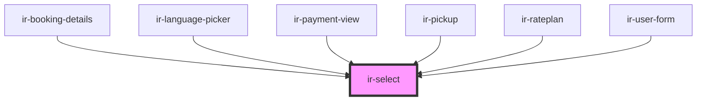

# ir-select

<!-- Auto Generated Below -->

## Properties

| Property    | Attribute   | Description | Type                                                                             | Default     |
| ----------- | ----------- | ----------- | -------------------------------------------------------------------------------- | ----------- |
| `data`      | --          |             | `{ id: string \| number; value: string; disabled?: boolean; html?: boolean; }[]` | `undefined` |
| `icon`      | `icon`      |             | `boolean`                                                                        | `undefined` |
| `label`     | `label`     |             | `string`                                                                         | `undefined` |
| `select_id` | `select_id` |             | `string`                                                                         | `v4()`      |
| `value`     | `value`     |             | `number \| string`                                                               | `undefined` |
| `variant`   | `variant`   |             | `"default" \| "double-line"`                                                     | `'default'` |

## Events

| Event         | Description | Type                            |
| ------------- | ----------- | ------------------------------- |
| `valueChange` |             | `CustomEvent<number \| string>` |

## Dependencies

### Used by

 - [ir-booking-details](../../ir-booking-engine/ir-checkout-page/ir-booking-details)
 - [ir-language-picker](../../ir-booking-engine/ir-nav/ir-language-picker)
 - [ir-payment-view](../../ir-booking-engine/ir-checkout-page/ir-booking-summary/ir-payment-view)
 - [ir-pickup](../../ir-booking-engine/ir-checkout-page/ir-pickup)
 - [ir-rateplan](../../ir-booking-engine/ir-booking-page/ir-rateplan)
 - [ir-user-form](../../ir-booking-engine/ir-checkout-page/ir-user-form)

### Graph

----------------------------------------------

*Built with [StencilJS](https://stenciljs.com/)*
