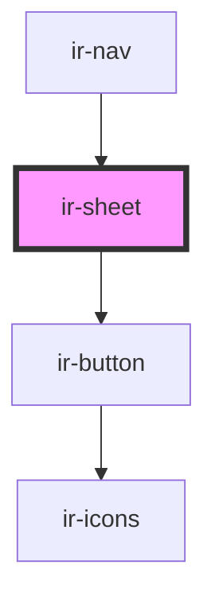

# ir-sheet

<!-- Auto Generated Below -->

## Properties

| Property          | Attribute           | Description | Type      | Default     |
| ----------------- | ------------------- | ----------- | --------- | ----------- |
| `hideCloseButton` | `hide-close-button` |             | `boolean` | `undefined` |
| `open`            | `open`              |             | `boolean` | `undefined` |

## Events

| Event        | Description | Type                   |
| ------------ | ----------- | ---------------------- |
| `openChange` |             | `CustomEvent<boolean>` |

## Methods

### `closeSheet() => Promise<void>`

#### Returns

Type: `Promise<void>`

### `openSheet() => Promise<void>`

#### Returns

Type: `Promise<void>`

## Dependencies

### Used by

 - [ir-nav](../../ir-booking-engine/ir-nav)

### Depends on

- [ir-button](../ir-button)

### Graph

----------------------------------------------

*Built with [StencilJS](https://stenciljs.com/)*
