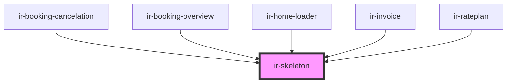

# ir-skeleton

<!-- Auto Generated Below -->

## Properties

| Property        | Attribute        | Description | Type                                | Default     |
| --------------- | ---------------- | ----------- | ----------------------------------- | ----------- |
| `customClasses` | `custom-classes` |             | `string`                            | `undefined` |
| `styles`        | --               |             | `{ [className: string]: boolean; }` | `undefined` |

## Dependencies

### Used by

 - [ir-booking-cancelation](../../ir-booking-cancelation)
 - [ir-booking-overview](../../ir-booking-engine/ir-booking-listing/ir-booking-overview)
 - [ir-home-loader](../../ir-home-loader)
 - [ir-invoice](../../ir-invoice)
 - [ir-rateplan](../../ir-booking-engine/ir-booking-page/ir-rateplan)

### Graph

----------------------------------------------

*Built with [StencilJS](https://stenciljs.com/)*
