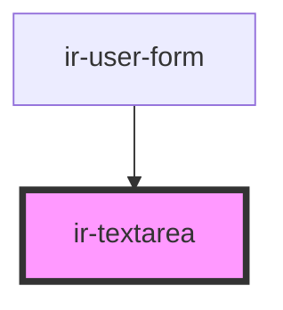

# ir-textarea

<!-- Auto Generated Below -->

## Properties

| Property       | Attribute      | Description | Type               | Default     |
| -------------- | -------------- | ----------- | ------------------ | ----------- |
| `autocomplete` | `autocomplete` |             | `string`           | `undefined` |
| `autofocus`    | `autofocus`    |             | `boolean`          | `undefined` |
| `class`        | `class`        |             | `string`           | `undefined` |
| `disabled`     | `disabled`     |             | `boolean`          | `undefined` |
| `error`        | `error`        |             | `boolean`          | `false`     |
| `inputId`      | `input-id`     |             | `string`           | `v4()`      |
| `inputid`      | `inputid`      |             | `string`           | `undefined` |
| `label`        | `label`        |             | `string`           | `undefined` |
| `leftIcon`     | `left-icon`    |             | `boolean`          | `false`     |
| `max`          | `max`          |             | `number \| string` | `undefined` |
| `maxlength`    | `maxlength`    |             | `number`           | `undefined` |
| `min`          | `min`          |             | `number \| string` | `undefined` |
| `multiple`     | `multiple`     |             | `boolean`          | `undefined` |
| `name`         | `name`         |             | `string`           | `undefined` |
| `pattern`      | `pattern`      |             | `string`           | `undefined` |
| `placeholder`  | `placeholder`  |             | `string`           | `undefined` |
| `readonly`     | `readonly`     |             | `boolean`          | `undefined` |
| `required`     | `required`     |             | `boolean`          | `undefined` |
| `size`         | `size`         |             | `number`           | `undefined` |
| `step`         | `step`         |             | `number \| string` | `undefined` |
| `value`        | `value`        |             | `string`           | `undefined` |

## Events

| Event         | Description | Type                      |
| ------------- | ----------- | ------------------------- |
| `inputBlur`   |             | `CustomEvent<FocusEvent>` |
| `inputFocus`  |             | `CustomEvent<FocusEvent>` |
| `textChanged` |             | `CustomEvent<string>`     |

## Dependencies

### Used by

 - [ir-user-form](../../ir-booking-engine/ir-checkout-page/ir-user-form)

### Graph

----------------------------------------------

*Built with [StencilJS](https://stenciljs.com/)*
