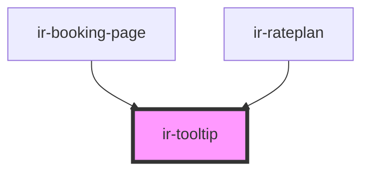

# ir-tooltip

<!-- Auto Generated Below -->

## Properties

| Property        | Attribute       | Description | Type                            | Default     |
| --------------- | --------------- | ----------- | ------------------------------- | ----------- |
| `label`         | `label`         |             | `string`                        | `undefined` |
| `labelColors`   | `label-colors`  |             | `"default" \| "green" \| "red"` | `'default'` |
| `message`       | `message`       |             | `string`                        | `undefined` |
| `open_behavior` | `open_behavior` |             | `"click" \| "hover"`            | `'hover'`   |
| `withHtml`      | `with-html`     |             | `boolean`                       | `true`      |

## Events

| Event               | Description | Type                   |
| ------------------- | ----------- | ---------------------- |
| `tooltipOpenChange` |             | `CustomEvent<boolean>` |

## Dependencies

### Used by

 - [ir-booking-page](../../ir-booking-engine/ir-booking-page)
 - [ir-rateplan](../../ir-booking-engine/ir-booking-page/ir-rateplan)

### Graph

----------------------------------------------

*Built with [StencilJS](https://stenciljs.com/)*
